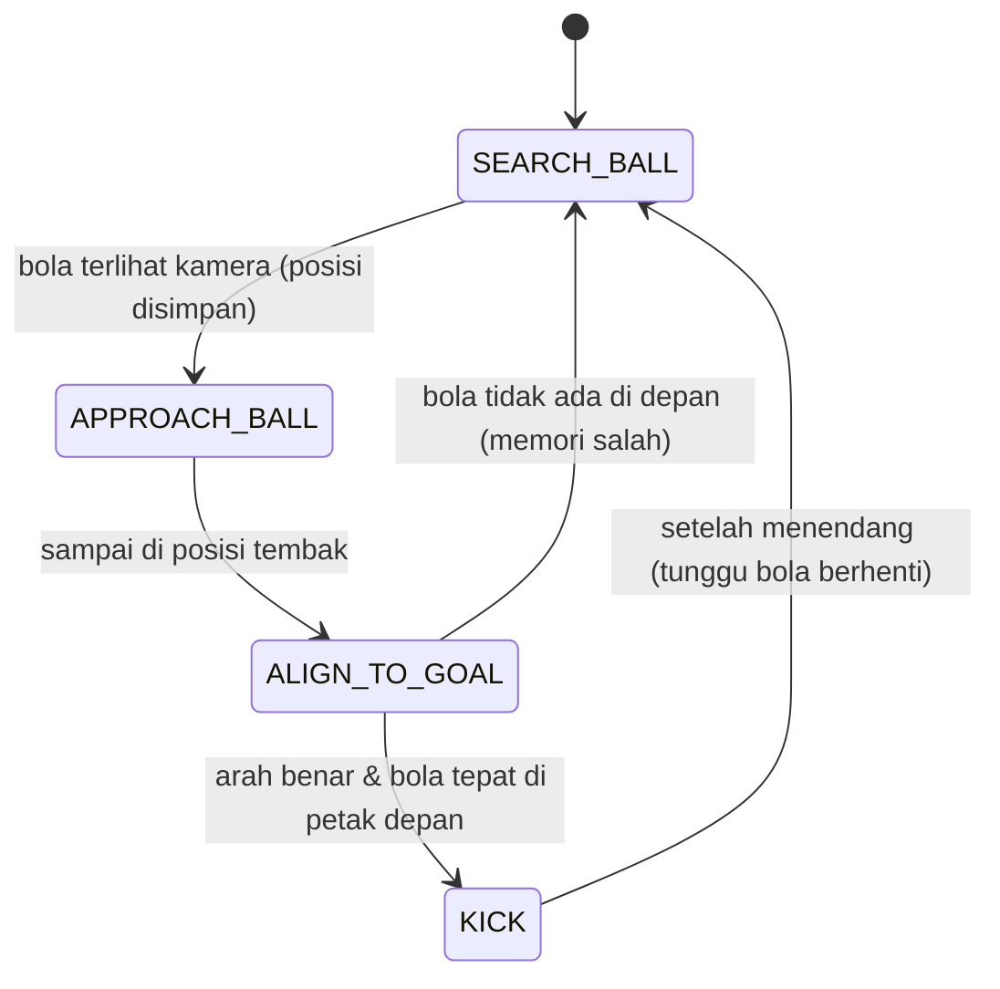
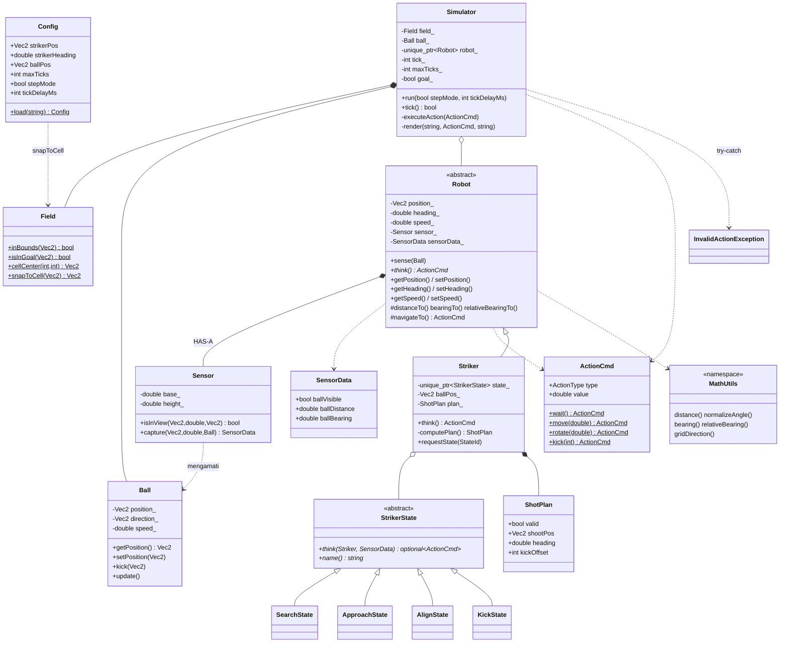

# MAINAN ROBOT – Simulasi Striker ICHIRO (C++ / OOP)

Simulasi 2D berbasis terminal: satu robot **Striker** mencari bola, mendekati, mengatur posisi tembak,
lalu menendang bola ke gawang lawan. Game loop berbasis tick (1 tick = 1 detik di dunia simulasi) dengan siklus
**Sense → Think → Act**. Tampilan berjalan sebagai animasi di terminal: tiap tick ditahan beberapa
milidetik (default 500 ms) supaya gerak robot dan bola bisa diikuti mata.

## Struktur Proyek
```
include/  Types.hpp  Field.hpp  Ball.hpp  Sensor.hpp  Robot.hpp  Striker.hpp  Simulator.hpp  Config.hpp
src/      Field.cpp  Ball.cpp   Sensor.cpp Robot.cpp   Striker.cpp Simulator.cpp Config.cpp  main.cpp
tests/    test_math.cpp
config.txt
```

## Cara Kompilasi & Menjalankan
Butuh compiler dengan C++17 (hanya Standard Library). Jalankan dari folder utama proyek (yang berisi `include/` dan `src/`).

```bash
# Simulasi (Linux / macOS / Git Bash)
g++ -std=c++17 -Wall -static -Wextra -Iinclude src/*.cpp -o soccer_sim

# Windows PowerShell / cmd (daftar file ditulis eksplisit supaya pasti terbaca)
g++ -std=c++17 -Wall -static -Wextra -Iinclude src/Ball.cpp src/Config.cpp src/Field.cpp src/main.cpp src/Robot.cpp src/Sensor.cpp src/Simulator.cpp src/Striker.cpp -o soccer_sim
```

```bash
./soccer_sim                   # pakai config.txt, jeda sesuai tick_delay_ms (Windows: .\soccer_sim.exe)
./soccer_sim config.txt        # pilih file konfigurasi lain
./soccer_sim config.txt 200    # menimpa jeda tick menjadi 200 ms
./soccer_sim config.txt 0      # tanpa jeda (langsung selesai)
```

> Setelah mengubah file `.hpp` atau `.cpp`, kompilasi ulang. Menjalankan `soccer_sim` lama
> akan memakai kode lama.

### Unit test
```bash
g++ -std=c++17 -Wall -Wextra -Iinclude tests/test_math.cpp src/Field.cpp src/Ball.cpp src/Sensor.cpp -o test_math
./test_math          # Windows: .\test_math.exe
```
Keluaran yang diharapkan: `40/40 test lolos` (exit code 0). Jika ada yang gagal, program mencetak
`FAIL (baris N): <kondisi>` dan exit code 1.

| Fungsi test | Yang diuji |
|---|---|
| `testMath` | `distance`, `normalizeAngle` (190, -190, 360, 540, -180), `bearing`, `relativeBearing`, `gridDirection` |
| `testField` | `inBounds`, `isInGoal` (kolom gawang dan lebar |y| <= 1.5), `cellCenter`, `snapToCell` |
| `testSensor` | Segitiga kamera selalu 3 + 5 + 7 = 15 petak untuk 4 arah hadap; petak depan, ujung alas, belakang, dan di luar jangkauan; `capture` (jarak dan sisi kiri/kanan) |
| `testBall` | Fisika bola 6 + 4 + 2 petak lalu berhenti; bola masuk gawang; bola menabrak dinding; exception untuk arah (0,0) dan posisi di luar lapangan |

### config.txt
| key | arti |
|---|---|
| `striker_x`, `striker_y` | posisi awal striker (m), otomatis dibulatkan ke pusat petak |
| `striker_heading` | 0 = Timur, 90 = Utara, 180 = Barat, 270 = Selatan (harus kelipatan 90) |
| `ball_x`, `ball_y` | posisi awal bola (m) |
| `max_ticks` | batas tick simulasi (harus > 0) |
| `step_mode` | 1 = tekan Enter untuk tiap tick (jeda animasi diabaikan) |
| `tick_delay_ms` | jeda antar tick dalam milidetik untuk animasi (default 500, 0 = tanpa jeda, tidak boleh negatif) |

Format: `key = value` atau `key value`; teks setelah `#` dianggap komentar.
Jika file tidak ditemukan / salah format, program memberi peringatan dan memakai nilai default.

## Output
`R` robot, `@` jarak pandang, `O` bola, `.` kosong, `#` gawang, elemen dipisah spasi.
Setiap petak = 0.5 m, lapangan 18 x 12 petak. Gawang = kolom paling kanan, 6 petak (3 m) di sekitar y = 0.
Tiap tick layar dihapus dan digambar ulang (ANSI escape code) sehingga tampil seperti animasi.
Terminal yang dipakai harus mendukung ANSI (Terminal VS Code, Windows Terminal, terminal Linux/macOS).

## Penyederhanaan Model
* Robot berjalan 1 petak (0.5 m) per tick dan menghadap 4 arah mata angin; rotasi kelipatan 90 derajat.
* Bola bergerak petak demi petak: tendangan lurus atau diagonal (hadap, hadap ±45 derajat).
  Jarak tempuh bola: 3 m + 2 m + 1 m = 6 m = 12 petak (3 tick), berhenti jika menabrak batas lapangan.
* Bola dianggap masuk gawang begitu sampai di petak `#`.
* Kamera segitiga (alas 3.5 m, tinggi 1.5 m) = 3 + 5 + 7 petak di depan robot.
* Bola yang berada tepat di pojok lapangan tidak bisa ditendang lagi (robot tidak bisa berdiri di belakangnya).

## Skenario Uji
| # | Skenario | Hasil yang diharapkan |
|---|---|---|
| 1 | Default (`config.txt`): striker (-3.75,-1.25), bola (0.25,0.75) | Gol di tick 49 |
| 2 | Bola tepat di depan striker, hadap gawang | Langsung ALIGN → KICK → gol |
| 3 | Bola di dinding atas/bawah atau jauh dari gawang (butuh >1 tendangan) | Striker menendang bertahap sampai gol |
| 4 | Striker dan bola di petak sama | Error ditangkap dan dilaporkan |
| 5 | File config tidak ada / rusak | Peringatan, memakai default |
| 6 | Bola diletakkan di setiap petak lapangan (216 petak, striker default, tanpa jeda) | 211 gol, 0 aksi tidak valid; 1 petak dilewati (sama dengan petak striker); 4 gagal = 4 pojok lapangan (batasan model) |
| 7 | `tick_delay_ms` = 500 vs 0 | Hasil gol sama; hanya kecepatan tampilan yang berbeda |
| 8 | Unit test (`test_math`) | `40/40 test lolos` |

## Alur State Kecerdasan Striker (State Pattern)

* **SEARCH_BALL**: putar 4 arah (3 kali putar 90 derajat), lalu jalan ke titik patroli berikutnya.
  6 titik patroli x blok 7x7 petak menutup seluruh lapangan.
* **APPROACH_BALL**: hitung rencana tembakan (posisi, arah hadap, offset tendangan) memakai BFS atas fisika bola
  (jumlah tendangan minimum sampai gol), lalu jalan ke posisi tembak tanpa menginjak bola.
* **ALIGN_TO_GOAL**: putar sampai arah sesuai rencana dan pastikan kamera melihat bola di petak depan.
* **KICK**: kirim aksi `KICK(offset)` dengan offset -1 (miring bawah), 0 (lurus), +1 (miring atas).

Alur satu tick di `Simulator::tick()`: Sense (`Robot::sense` → `Sensor::capture`) → Think (`Striker::think` →
state aktif) → Act (`executeAction`, divalidasi, `try-catch`) → fisika bola (`Ball::update`) → render.

## Class Diagram

`main()` membaca `Config`, lalu membuat `Ball` dan `Striker` dan menyerahkannya ke `Simulator`.

## Pemenuhan Level
* **Level 1**: `Field`, `Ball`, `Simulator`, abstract `Robot` (atribut private + getter/setter tervalidasi),
  `Striker` mewarisi `Robot` dan meng-override `think()`. Rumus jarak, bearing, normalisasi sudut
  hanya ada di `MathUtils` (`Types.hpp`) dan dipanggil lewat `Robot` (DRY).
* **Level 2**: `Robot` HAS-A `Sensor` (composition). Robot tidak membaca posisi bola dari `Simulator`; hanya lewat
  `SensorData` kamera. `InvalidActionException` dilempar (kecepatan >0.5, keluar lapangan, menabrak bola,
  tendang tanpa bola di depan, rotasi bukan kelipatan 90) dan ditangkap dengan `try-catch` di `Simulator::tick()`.
* **Level 3**: file konfigurasi (`config.txt`, termasuk `tick_delay_ms`), State Pattern (`SearchState`, `ApproachState`,
  `AlignState`, `KickState`), dan unit test (`tests/test_math.cpp`, 40 pengecekan).

## Pernyataan Penggunaan AI
Saya menggunakan AI (Claude, Anthropic) secara dominan dalam proyek ini. Saya masih baru dalam C++, jadi saya
memakai AI untuk brainstorming ide dan alur program, lalu meminta AI membantu menerjemahkan logika yang saya
bayangkan ke dalam kode C++.

Kode yang dikumpulkan ini **bukan sepenuhnya hasil tulisan saya sendiri**. Karena banyaknya tugas dan kegiatan
pada waktu yang sama, saya terpaksa mempercepat pengerjaan dengan bantuan AI. Bagian yang dibuat dengan bantuan AI:

* Seluruh source code di `include/` dan `src/` (Field, Ball, Sensor, Robot, Striker beserta State Pattern, Simulator, Config, main).
* Unit test `tests/test_math.cpp` dan file `config.txt`.
* Fitur animasi (`tick_delay_ms`, jeda antar tick, dan perubahan `Simulator::run` / `render`).
* Draft README, class diagram, dan penjelasan kode.

Saya memakai AI juga untuk menjelaskan isi kode kepada saya sambil saya belajar, dan saya menjalankan
simulasi serta unit test untuk melihat hasilnya sendiri.
